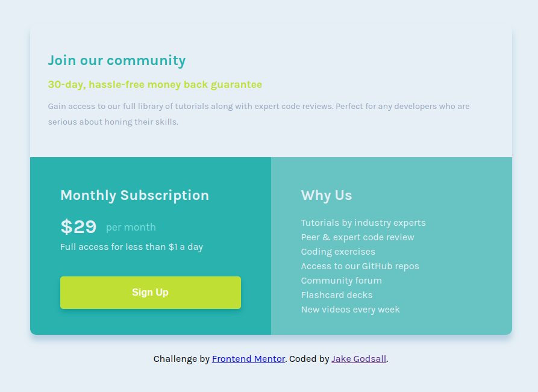

# Frontend Mentor - Single price grid component solution

This is a solution to the [Single price grid component challenge on Frontend Mentor](https://www.frontendmentor.io/challenges/single-price-grid-component-5ce41129d0ff452fec5abbbc). Frontend Mentor challenges help you improve your coding skills by building realistic projects. 

## Table of contents

- [Overview](#overview)
  - [The challenge](#the-challenge)
  - [Screenshot](#screenshot)
  - [Links](#links)
- [My process](#my-process)
  - [Built with](#built-with)
  - [What I learned](#what-i-learned)
  - [Continued development](#continued-development)
- [Author](#author)

**Note: Delete this note and update the table of contents based on what sections you keep.**

## Overview

### The challenge

Users should be able to:

- View the optimal layout for the component depending on their device's screen size
- See a hover state on desktop for the Sign Up call-to-action

### Screenshot

### Links

- Live Site URL: [Netlify](https://jakegodsall-single-price-grid.netlify.app/)

## My process

### Built with

- Semantic HTML5 markup
- CSS custom properties
- Flexbox
- Mobile-first workflow

### What I learned

- That by using `height:100vh` property for the `body`, there is a chance of cutting off content when loaded on a mobile device. 
- That vertical centring is not really necessary for mobile development, and hence should be employed for desktop inside a media query (when using mobile-first workflow).
- Styling `li` elements with CSS.
- How adding a `box-shadow` can be used to add a three-dimensional effect of an object even if it is the same colour as its background.

### Continued development

- To continue using the skills I have learned thus far until they become completely intuitive.
- To be more cognisant of the design principles employed at the stage prior to the challenge by the challenge author.

## Author

- Website - [Jake Godsall](https://jakegodsall.com)
- Frontend Mentor - [@jakegodsall](https://www.frontendmentor.io/profile/jakegodsall)
- LinkedIn - [@godsalljake](https://www.linkedin.com/in/godsalljake/)
